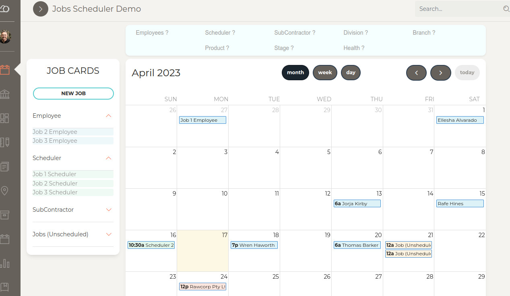
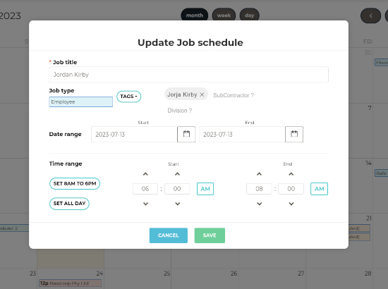

## Jobs Scheduler demo

Single Page Application that allows you to create and schedule job cards and move them across a calendar. Job cards are associated with defined types and can be tagged and filtered with defined labels.

The app is built with Angular and Bootstrap, and was a quick frontend prototype presented at Strategik Pty Ltd.

### [Live demo](https://jobscheduler.dmxnetworks.com.au/)

## Frameworks and Libraries

| Angular @^9 | Bootstrap @^4 |
|-------------|---------------|

## Table of Contents

- [Development server](#development-server)
- [Production](#production)
- [Tests](#tests)
- [Quick Start](#quick-start)
- [Further help](#further-help)
- [Documentation](#documentation)
- [Browser Support](#browser-support)

## Development server

`npm run start` to serve project as local dev server. Navigate to `http://localhost:4200/`.

`npm run build` to build project for dev deployment. Build artifacts will be stored in the `dist/` directory.

## Production

`npm run build:prod` to build project for production deployment. Build artifacts will be stored in the `dist/` directory.

## Tests

`npm run lint` static analysis TypeScript linter with [TSLint](https://palantir.github.io/tslint/)

`npm run test` unit tests with [Karma](https://karma-runner.github.io)

`npm run e2e` e2e tests with [Jasmine](https://jasmine.github.io/) and [Protractor](http://www.protractortest.org/)

## Quick start

1. Download and Install NodeJs LTS version from [NodeJs Official Page](https://nodejs.org/en/download/).
2. Navigate to the root ./ directory of the product and run `yarn install` or `npm install` to install our local dependencies.

## Further help

To get more help on the Angular CLI use `ng help` or go check out the [Angular CLI README](https://github.com/angular/angular-cli/blob/master/README.md).

## Documentation

The project is embedded within  [Paper Dashboard Pro Angular by Creative Tim](./Paper-Dashboard-Pro-Angular.md)

## Browser Support

Support for the last two versions of the following browsers:

    
